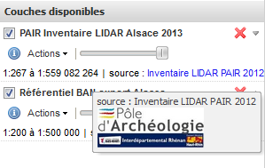

**Coopération pour l'Information Géographique en Alsace**

# Comment publier votre couche SIG sur la géoplateforme CIGAL ?

<!-- TOC depthFrom:2 depthTo:3 withLinks:1 updateOnSave:0 orderedList:0 -->

- [Contexte](#contexte-)
- [Définitions](#définitions-)
	- [Geoserver et administration déléguée](#gs-admin-delegue-)
	- [WMS](#wms-)
	- [WFS](#wfs-)
	- [SLD](#sld-)
- [Principes de base](#principes-de-base-)
- [Procédure](#procédure-)
	- [Dépôt des données SHP via Pydio](#depot-shp-via-pydio--)
	- [Création de la couche WMS WFS sous Geoserver](#creation-layer-geoserver-)
	- [Exporter un SLD](#creation-du-style-sld-)
	- [Paramétrages complémentaires des couches](#gestion-des-couches-gs-)

<!-- /TOC -->

## Contexte 

Vous êtes adhérant CIGAL et ne disposez pas d'outil pour publier des flux WMS WFS conformément à la directive INSPIRE. Votre donnée est déjà décrite dans le catalogue CIGAL conformément à https://www.cigalsace.org/portail/fr/doc/774/guide-comment-decrire-simplement-vos-donnees-geographiques-et-rendre-consultables-sur

## Définitions 

### Geoserver et administration déléguée

Geoserver est un serveur cartographique permettant aux utilisateurs de partager et de modifier des données géographiques en respectant les normes et standards d'interopérabilité. Geoserver est un module de l'outil d'IDS georchestra sur lequel se base la géoplateforme CIGAL. **Les services de Geoserver sont gérés par un administrateur de donnée qui a la possibilité de déléguer des droits à un partenaire sur un espace de travail qui lui est dédié**. Dans cet espace le partenaire que l'on nommera administrateur délégué a la possibilité de créer des flux WMS couplés WFS ainsi que de mettre en forme les styles par défaut SLD pour les WMS.

### WMS 

Le **Web Map Service** est un standard OGC (pour Open Geospatial Consortium) de service web qui permet de produire dynamiquement des cartes à partir de données géoréférencées. Les cartes se présentent sous la forme de tuiles image avec une fonctionnalité basique d’interrogation des attributs d'objet.

Pour de plus amples informations https://tice.agrocampus-ouest.fr/mod/page/view.php?id=27488

### WFS 

Le **Web Feature Service** est un standard OGC de Service Web dédiée à la publication d’objets géographiques vecteurs (lignes, points, polygones...) ainsi que leur structure. L'interface permet le téléchargement et la manipulation des données vecteur. La fonctionnalité d'édition WFS-T n'est pas activée.

Pour de plus amples informations https://tice.agrocampus-ouest.fr/mod/page/view.php?id=27489

### SLD 

Le **Style Layer Descriptor** est un format interopérable pour du stylage de données géographiques.
Il existe toute une série d'interfaces graphiques pour créer des SLD comme le visualiseur CIGAL ou QGIS.

L'outil styler du visualiseur CIGAL https://www.cigalsace.org/mapfishapp/ dans
*Couches disponibles/Actions/Éditer la symbologie/*

*Analyse/Ajouter une classe/Télécharger le style*

Enregistrer le style sur son poste de travail.

Sous QGIS
*Couche/Propriété/Style/Enregistrer le style/Fichier SLD*

## Principes de base 

Il est dorénavant possible sur la géoplateforme CIGAL à un administrateur délégué de disposer de toute la chaîne de publication pour créer ses couches vecteur sur un espace de travail qui lui est dédié dans Geoserver.

 :warning: **Bien respecter les règles de nommage et  vérifier que les styles et les couches poussées sur la plateforme soient fonctionnels.**

Le principe est le suivant:

1. Dépôt des données SHP via Pydio
2. Création de la couche WMS WFS sous Geoserver
3. Exporter un style SLD
4. Paramétrages complémentaires des couches

Cette démarche s'appuie sur les outils suivants :

- Pydio: <https://www.cigalsace.org/files/?login> Pour déposer ses données sur le serveur
- Geoserver: <https://www.cigalsace.org/geoserver/web/?login> Pour créer ses couches
- Mapfishapp: <https://www.cigalsace.org/mapfishapp> Pour visualiser et créer les styles

Avant de poursuivre, vous devez disposer d'un identifiant et d'un mot de passe pour vous connecter à la plateforme CIGAL, ainsi que d'un espace de stockage sur Pydio et un accès vers un espace de travail Geoserver.
 :envelope: **Si ce n'est pas le cas, les chefs de projet CIGAL sont à votre disposition <mailto:contact@cigalsace.org>.**

## Procédure 

### Dépôt des données SHP via Pydio 

Pour vous connecter à Pydio, rendez-vous à l'adresse : <https://www.cigalsace.org/files/?login> saisissez votre identifiant et votre mot de passe avant de valider.

Une fois dans Pydio, sélectionnez dans la liste de gauche votre dépôt de données. Son nom est de la forme « data_ORG » où « ORG » correspond au nom ou au sigle de votre organisme.

Il vous est ensuite possible de déposer des fichiers par simple glisser/déposer sur l'écran (bouton « Transférer » en haut à droite)

 :notebook_with_decorative_cover: **_Notes :_**
- Seuls les formats shapefile SHP sont supportés pour le moment.
- Vos SHP doivent tous être regroupés dans un seul et même répertoire.
- Écraser un shapefile du même nom va directement mettre à jour la donnée dans Geoserver.
- Supprimer un shapefile nécessite de supprimer à la main la couche correspondante dans Geoserver.

### Création de la couche WMS WFS sous Geoserver 

Pour vous connecter à Geoserver, rendez-vous à l'adresse : <https://www.cigalsace.org/geoserver/web/?login>
Vous devriez normalement disposer des fonctionnalités suivantes dans le menu à gauche

Créer une couche correspond à un WMS associé avec WFS, les deux sont par défaut publics.

**__Commencez par créer une couche :exclamation:__ :**

Dans le menu gauche choisir "Couches" puis "Ajouter une nouvelle ressource"

Chercher l'entrepôt **ORG:ORG_SHP** puis publier la couche SHP souhaitée

**__Paramètres à préciser pour chaque couche__ :**

Le formulaire se présente ainsi:

Le nom de la couche devra être sous la forme **ORG_xxx** par exemple *CD67_CANTON_STRAS_2015_3948*

Le titre de la couche devra être sous la forme **ORG xxx** par exemple *CD67 Cantons Strasbourg 2015*

Le résumé de la couche est un champ texte libre qui apporte des informations par exemple "*Limites des cantons de Strasbourg, tels que redéfinis pour les élections départementales de mars 2015. E(SBG), E(1/50000), P(3948)*"

Il faut maintenant vérifier les **systèmes de référence de coordonnées**. Le SRC des données doit être le même que le SRC natif. Si ce dernier n'est pas pré rempli, ajoutez-le à la main (Rechercher par code EPSG)

Cliquer en suite sur "Basées sur les données" puis sur "Calculées sur les emprises natives"

C'est seulement à ce moment que Geoserver vous permet de paramétrer le lien vers la métadonnée de donnée.

Toujours dans le formulaire de la couche, lier le service WMS à la métadonnée en cliquant sur "Ajouter un lien"

Saisissez à minima les formats txt/html et text/XML
L'URL de la métadonnée peut être récupérée depuis le catalogue https://www.cigalsace.org/geonetwork/apps/georchestra/?hl=fre

Ouvrir la fiche et copier le lien en haut à droite

De retour sur Geoserver vous pouvez maintenant créer la couche en bas du formulaire "Sauvegarder"

Vérifier quelle est bien dans la liste de couches en cliquant sur couche puis faire une recherche textuelle pour la retrouver

Attention sans la recherche textuelle (entouré en rouge dans l'image) la couche ne va peut être pas s'afficher (c'est un bug mineur)

La couche se retrouve bien là c'est quasi gagné  :+1:

Pour en être bien certain, dans le menu gauche "Prévisualisation de la couche" puis "OpenLayers"

Vous visualiserez de cette manière les données avec la possibilité d'interroger les objet en cliquant dessus.

Voici un exemple de prévisualisation Open Layer
https://www.cigalsace.org/geoserver/SLM67/wms?service=WMS&version=1.1.0&request=GetMap&layers=SLM67:SLM67_COMMUNES_COL_L93&styles=&bbox=1045480.4636068232,6831934.8059389,1056136.5844213301,6849241.151293313&width=472&height=768&srs=EPSG:2154&format=application/openlayers

### Exporter un style SLD 

Rendez vous sur le visualiseur CIGAL Mapfishapp https://www.cigalsace.org/mapfishapp

En bas à droite "Ajouter des couches"

Dans l'onglet serveur OGC, saisir votre adresse WMS en remplaçant **xxx** par le nom de votre espace de travail Geoserver
https://www.cigalsace.org/geoserver/**xxx**/ows

Touche "Entrée" puis tirer la couche via le bouton "Ajouter"

Depuis l'arbre des couche retrouver la cartouche qui correspond à votre donnée
*Couches disponibles/Actions/Éditer la symbologie/*

*Analyse/Ajouter une classe/Télécharger le style*

### Paramétrages complémentaires des couches

Retournez dans Geoserver et enregistrer le style de la manière suivante

Menu gauche "Style", choisir "Ajouter un nouveau style"

Copier coller le xml correspondant au SLD téléchargé dans le chapitre précédent.

Des exemples de SLD sont disponibles ici http://docs.geoserver.org/stable/en/user/styling/sld/cookbook/

Retourner sur la couche, menu gauche "Couches" puis sélectionner la couche,  onglet publication.
Il sera alors possible de paramétrer le style par défaut

 :warning: Ne pas oublier de Sauvegarder en bas du formulaire

Vérifier que la couche est bien visible, menu gauche *prévisualisation/openlayer*

Enfin, vous avez la possibilité également d'affecter à vos couches vos attributions
Couche/onglet publication

Par exemple

>Inventaire LIDAR PAIR 2012
http://www.pair-archeologie.fr/
https://www.cigalsace.org/metadata/CIGAL/Logo/Logo_PAIR.jpg
image/jpeg
120
45

Ce qui donne au survol de la sourie dans Mapfishapp

