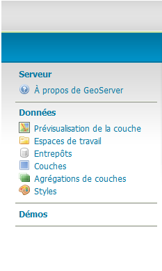

**Coopération pour l'Information Géographique en Alsace**

# Comment publier votre couche SIG sur la géoplateforme CIGAL ?

<!-- TOC depthFrom:2 depthTo:3 withLinks:1 updateOnSave:0 orderedList:0 -->

- [Contexte](#contexte-)
- [Définitions](#définitions-)
	- [Geoserver et administration déléguée](#gs-admin-delegue-)
	- [WMS](#wms-)
	- [WFS](#wfs-)
	- [SLD](#sld-)
- [Principes de base](#principes-de-base-)
- [Procédure](#procédure-)
	- [Dépôt des données SHP via Pydio](#depot-shp-via-pydio--)
	- [Création de la couche WMS/WFS à partir de l'entrepôt de SHP](#creation-layer-geoserver-)
	- [Création du style SLD](#creation-du-style-sld-)
	- [Gestion des couches et paramètrages par le partenaire](#gestion-des-couches-gs-)

<!-- /TOC -->

## Contexte 

Vous êtes adhérant cigal et ne disposez pas d'outil pour publier des flux WMS WFS conformément à la directive INSPIRE. Vous avez déja décrit votre donnée dans le catalogue CIGAL https://www.cigalsace.org/portail/fr/doc/774/guide-comment-decrire-simplement-vos-donnees-geographiques-et-rendre-consultables-sur

## Définitions 

### Geoserver et administration déléguée

Geoserver est un serveur cartographique permettant aux utilisateurs de partager et de modifier des données géographiques en respectant les normes et standarts d'interropérabilité. Geoserver est un module de l'outil georchestra sur lequel se base la géoplateforme CIGAL. Les services de Geoserver sont gérés par un administrateur de donnée qui a la possibilité de délégué des droits à un partenaire sur un espace de travail qui lui est dédié. Dans cet espace le partenaire que l'on nommera administrateur délégué a la possibilité de créer des flux WMS couplés WFS ansi que de mettre en forme les styles par défaut SLD pour les WMS.

### WMS 

Le Web Map Service est un standard OGC (pour Open Geospatial Consortium) de service web qui permet de produire dynamiquement des cartes à partir de données géoréférencées. Les cartes se présentent sous la forme de tuiles d'image avec une fonctionnalité basique d'intérogation des attributs d'objet.

Pour de plus amples informations https://tice.agrocampus-ouest.fr/mod/page/view.php?id=27488

### WFS 

Le Web Feature Service, est un standard OGC de Service Web dédiée à la publication d’objets géographiques vecteurs (lignes, points, polygones...) ainsi que leur structure. l'interface permet le téléchargement et la manipulation des données vecteur. La fonctionnalité d'édition WFS-T n'est pas activée.

Pour de plus amples informations https://tice.agrocampus-ouest.fr/mod/page/view.php?id=27489

### SLD 

Le Style Layer Descriptor est un format interropérable de stylage de données géographiques.
Pour créer des style on peut utiliser le visualiseur CIGAL ou QGIS entre autres outils.

L'outil styler du visualiseur CIGAL https://www.cigalsace.org/mapfishapp/
Couches disponibles/Actions/Éditer la symbologie/

Analyse/Ajouter une classe/Télécharger le style

Sous QGIS
Couche/Propriété/Style/Eregistrer le style/Fichier SLD

## Principes de base 

L'administrateur délégué dispose de toute la chaîne de publication de ses couches sur un espace de travail qui lui est dédié sur la plateforme CIGAL.

Attention également à bien respecter les règles de nommage des couches.

Le principe est le suivant:

1. Dépôt des données SHP via Pydio
2. Création de la couche WMS/WFS à partir de l'entrepôt de SHP
3. Création du style SLD
4. Gestion des couches par le partenaire

Cette démarche s'appuie sur les outils suivants :

- Pydio: <https://www.cigalsace.org/files/?login> Il permet de déposer simplement des fichiers sur le serveur CIGAL pour les rendre accessibles via internet
- Geoserver: <https://www.cigalsace.org/geoserver/web/?login> Il permet de renseigner une fiche de description de données et de l'enregistrer au format XML
- Mapfishapp: <https://www.cigalsace.org/mapfishapp> Le visualiseur CIGAL permet de visualiser les couches et de créer les styles

Avant de poursuivre, vous devez disposer d'un identifiant et d'un mot de passe pour vous connecter à la plateforme CIGAL, ainsi que d'un espace de stockage sur Pydio et un accès Geoserver.
**Si ce n'est pas le cas, les chefs de projet CIGAL sont à votre disposition <mailto:contact@cigalsace.org>.**

## Procédure 

### Dépôt des données SHP via Pydio 

Pour vous connecter à Pydio, rendez-vous à l'adresse : <https://www.cigalsace.org/files> Si vous n'êtes pas encore authentifié, saisissez votre identifiant et votre mot de passe avant de valider.

Une fois dans Pydio, sélectionnez dans la liste de gauche votre dépôt de données. Son nom est de la forme « data_ORG » où « ORG » correspond au nom ou au sigle de votre organisme.

Il vous est ensuite possible de déposer des fichiers par simple glisser/déposer sur l'écran (bouton « Transférer » en haut à droite)

**_Recommandations :_**
- Vos shapefiles doivent tous être regoupés dans un seul répertoire.
- Ecraser un shapefile va directement mettre à jour la donnée dans Geoserver

### Création de la couche WMS/WFS à partir de l'entrepôt de SHP 

Pour vous connecter à Geoserver, rendez-vous à l'adresse : <https://www.cigalsace.org/geoserver/web/?login>
Vous devriez normalement disposer des fonctionnalitées suivantes dans le menu à gauche

**__Commencez par créer une couche!__ :**

Choisir "Couches" puis "Ajouter une nouvelle ressource"

Chercher l'entrepôt **ORG:ORG_SHP** puis publier la couche souhaitée

Voici les paramètres à préciser pour chaque couche

Le nom de la couche devra être sous la forme **ORG_xxx** par exemple CD67_CANTON_STRAS_2015_3948

Le titre de la couche devra être sous la forme **ORG xxx** par exemple CD67 Cantons Strasbourg 2015

Le résumé de la couche est un champ texte libre pour rajouter des informations par exemple "Limites des cantons de Strasbourg, tels que redéfinis pour les élections départementales de mars 2015. E(SBG), E(1/50000), P(3948)"

Il faut maintenant vérifier les systèmes de référence de coordonnées. Le SRC des données doit être le même que le SRC natif. Si ce dernier n'est pas pré rempli, ajoutez le à la main (Rechercher)

Cliquer en suite sur "Basées sur les données" puis sur "Calculées sur les emprises natives"

C'est seulement à ce moment que Geoserver vous permet de paramètré le lien vers la métadonnée.

Pour lier le service WMS à la métadonnée cliquer sur "Ajouter un lien"

Remplir au moins aux format txt/html et text/XML
L'URL de la métadonnée peut être récupérée sur le géocatalogue https://www.cigalsace.org/geonetwork/apps/georchestra/?hl=fre
Ouvrir la fiche et récupérer le lien en haut à droite

De retour sur Geoserver vous pouvez maintenant créer la couche en bas du formulaire "Sauvegarder"

Et vérifier quelle est bien dans la liste de couches en cliquant sur couche puis faire une recherche textuelle pour la retrouver

Attention sans la recherche textuelle (entouré en rouge dans l'image) la couche ne va peut être pas s'afficher (c'est un bug mineur)

Vous pouvez ensuite essayer de la préviualiser, dans le menu gauche "prévisualisation de la couche" puis "OpenLayers"

Vous visualiserez de cette manière les données et pouvez les interroger en cliquant dessus par exemple
https://www.cigalsace.org/geoserver/SLM67/wms?service=WMS&version=1.1.0&request=GetMap&layers=SLM67:SLM67_COMMUNES_COL_L93&styles=&bbox=1045480.4636068232,6831934.8059389,1056136.5844213301,6849241.151293313&width=472&height=768&srs=EPSG:2154&format=application/openlayers

### Création du style SLD 

Pour créer un style vous pouvez chercher votre couche depuis Mapfishapp https://www.cigalsace.org/mapfishapp

"Ajouter des couches"

Onglet serveur OGC, saisissez votre adresse wms en remplaçant xxx par le nom de votre espace de travail Geoserver
https://www.cigalsace.org/geoserver/xxx/ows

Touche "Entrée" puis tirer la couche en sélectionnant "Ajouter"

Couches disponibles/Actions/Éditer la symbologie/

Analyse/Ajouter une classe/Télécharger le style

### Gestion des couches par le partenaire

Retournez dans Geoserver et enregistrer le style

Style/Ajouter un nouveau style

Copier coller le xml, exemple de sld

Des exemples de SLD sont disponibles dans le manuel de Geoserver http://docs.geoserver.org/stable/en/user/styling/sld/cookbook/

Retourner sur la couche onglet publication et paramétrez le style par défaut

Ne pas oublier de Sauvegarder en bas du formulaire

Vérifiez que la couche est bien visible, menu gauche prévisualisation/openlayer

Vous avez la possibilité également d'afecter à vos couches vos attributions
Couche/onglet publication

Par exemple

>Inventaire LIDAR PAIR 2012
http://www.pair-archeologie.fr/
https://www.cigalsace.org/metadata/CIGAL/Logo/Logo_PAIR.jpg
image/jpeg
120
45
