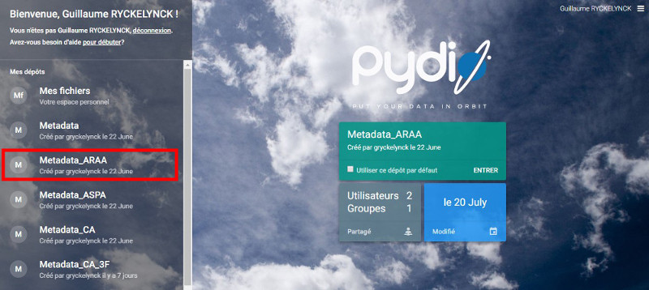
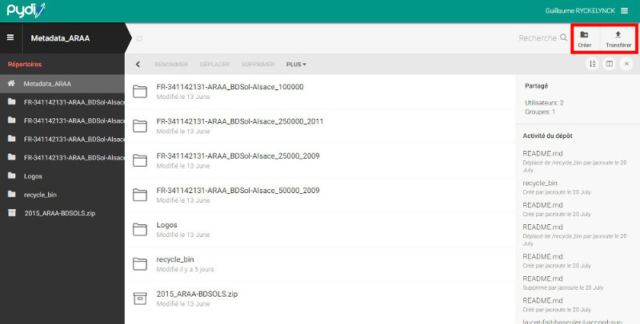
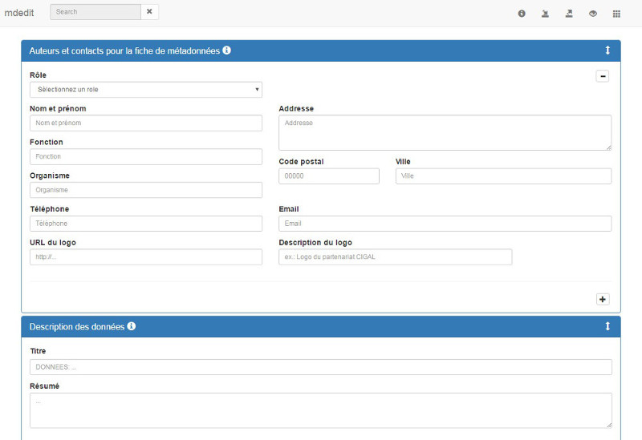
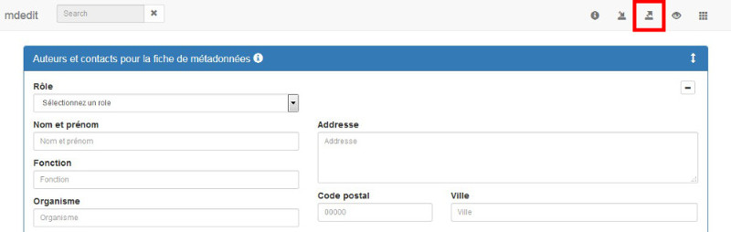

**Coopération pour l'Information Géographique en Alsace**

# Comment décrire simplement vos données géographiques et les rendre consultables sur la plateforme CIGAL ?

<!-- TOC depthFrom:2 depthTo:3 withLinks:1 updateOnSave:0 orderedList:0 -->

- [Contexte](README#contexte-)
- [Définitions](README#définitions-)
	- [Base de données](README#base-de-données-)
	- [Fiche de métadonnées](README#fiche-de-métadonnées-)
- [Principes de base](README#principes-de-base-)
- [Procédure](README#procédure-)
	- [Placer les fichiers ressources sur le serveur CIGAL](README#placer-les-fichiers-ressources-sur-le-serveur-cigal-)
	- [Décrire le jeu de données](README#décrire-le-jeu-de-données-)
	- [Exporter la fiche descriptive au format XML](README#exporter-la-fiche-descriptive-au-format-xml-)
	- [Déposer la fiche au format XML sur le serveur CIGAL](README#déposer-la-fiche-au-format-xml-sur-le-serveur-cigal-)

<!-- /TOC -->

## Contexte 

Vous ne disposez pas d'outil pour décrire vos données conformément aux obligations de la directive européenne Inspire, mais souhaitez faire connaître vos données en les référençant sur la plateforme CIGAL, ainsi que sur le géocatalogue national.

## Définitions 

### Base de données 

Les données sont généralement organisées en base de données. Nous utiliserons ici indifféremment les termes de base de données et jeux de données pour désigner un ensemble structuré de données géographiques sous forme de fichier (ex. : SHP, KML, etc.) ou selon une organisation plus complexe sous forme de base de données relationnelle.

La granularité ou niveau auquel le jeu de données est décrit est laissé à l'appréciation du gestionnaire des données. Il est cependant recommandé de décrire les jeux de données au niveau de la « couche d'information » qui doit être cohérente et homogène sur le territoire concerné.

### Fiche de métadonnées 

La description d'un jeu de données donne lieu à la rédaction d'une fiche de métadonnées. Il s'agit d'un document recueillant les principales informations sur la base de données : titre, résumé, auteur, gestionnaire, échelle d'utilisation, etc. Il s'accompagne également de ressources annexes, comme une illustration, un document de licence, le logo d'un contact, la liste des attributs et leur signification, etc.

La directive Inspire propose de standardiser cette description à la fois sur le contenu (informations à décrire) et sur la forme (stockage au format XML) en s'appuyant sur les normes en vigueur (cf. Guide d'implémentation Inspire pour a la description des données géographiques). Des recommandations nationales ont également été publiées au niveau du CNIG pour compléter ce guide (cf. Guide de saisie de métadonnées INSPIRE appliqué aux données).

Ainsi, à l'issue de votre travail vous disposerez pour chacune de vos données d'un fichier XML contenant l'ensemble des informations décrivant le jeu de données et pointant vers différents fichiers complétant cette description. Ces fichiers associés sont appelés « ressources » dans la suite du document.

## Principes de base 

La description d'un jeu de données et sa publication se font en différentes étapes :

1. Placer les fichiers ressources sur le serveur CIGAL
2. Décrire le jeu de données via un formulaire en ligne
3. Exporter la fiche descriptive au format XML
4. Placer la fiche au format XML sur le serveur CIGAL

Cette démarche s'appuie sur les outils suivants :

- Pydio: <https://www.cigalsace.org/files> Il permet de déposer simplement des fichiers sur le serveur CIGAL pour les rendre accessibles via internet
- mdEdit: <https://www.cigalsace.org/tools/mdEdit> Il permet de renseigner une fiche de description de données et de l'enregistrer au format XML

Avant de poursuivre, vous devez disposer d'un identifiant et d'un mot de passe pour vous connecter à la plateforme CIGAL, ainsi que d'un espace de stockage sur Pydio.
**Si ce n'est pas le cas, les chefs de projet CIGAL sont à votre disposition.**

## Procédure 

### Placer les fichiers ressources sur le serveur CIGAL 

Pour vous connecter à Pydio, rendez-vous à l'adresse : <https://www.cigalsace.org/files> Si vous n'êtes pas encore authentifié, saisissez votre identifiant et votre mot de passe avant de valider.

Une fois dans Pydio, sélectionnez dans la liste de gauche votre dépôt de métadonnées. Son nom est de la forme « Metadata_ORG » où « ORG » correspond au nom ou au sigle de votre organisme.

Il vous est ensuite possible :
- De créer des répertoires pour organiser vos fichiers (bouton « créer » en haut à droite)
- De déposer des fichiers par simple glisser/déposer sur l'écran (bouton « Transférer » en haut à droite)

Les fichiers ainsi déposés sur la plateforme CIGAL sont alors disponibles via une adresse du type « <https://www.cigalsace.org/metadata/ORG/REP/ressource.ext> », où :
- « ORG » est le nom de la structure ou son sigle (identique au « ORG » du nom de dépôt Pydio)
- « REP » est, le cas échéant, le chemin vers les fichiers dans le dépôt sur Pydio
- « ressource.ext » est le nom du fichier de ressource concerné.

**_Recommandations :_**
- _Créer un répertoire pour chaque type de ressources transversales comme par exemple les logos qui sont utilisés par différentes fiches descriptives._
- _Créer un répertoire par jeu de données pour y placer les éléments spécifiques (illustration, document technique, liste des attributs de la couche, etc.)_

### Décrire le jeu de données 

La description du jeu de données peut être réalisée assez simplement directement en ligne via mdEdit. L'accès à cette application ne nécessite pas d'authentification. Il vous suffit de vous rendre à l'adresse suivante : <https://www.cigalsace.org/tools/mdEdit/>

_A la première connexion, en cas de problème d'affichage, il peut être nécessaire de rafraîchir la page !_

Il vous suffit alors de compléter le formulaire à partir des informations dont vous disposez sur le jeu de données. Pour plus de détail sur les informations attendues, vous pouvez vous rapportez au « Guide simplifié de saisie des métadonnées CIGAL ».

**_Liens vers les ressources :_**
_Les liens vers les ressources déposées sur la plateforme via Pydio doivent être renseignés selon une URL de la forme « <https://www.cigalsace.org/metadata/ORG/REP/ressource.ext> » comme décrit précédemment._

### Exporter la fiche descriptive au format XML 

Pour exporter la fiche descriptive au format XML, utiliser le bouton en haut à droite.

mdEdit permet également de recharger une fiche descriptive au format XML :
- Pour la consulter
- Pour la compléter ou la mettre à jour

Il est ainsi possible de créer une fiche partiellement remplie et de la réutiliser comme un modèle pour saisir de nouvelles fiches.

### Déposer la fiche au format XML sur le serveur CIGAL 

Le dépôt du fichier XML sur le serveur CIGAL se fait via Pydio selon le même principe que le dépôt des fichiers ressources expliqué ci-dessus.
