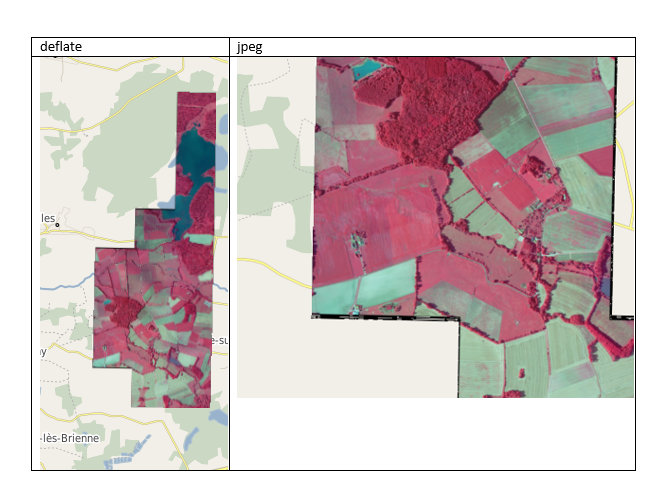
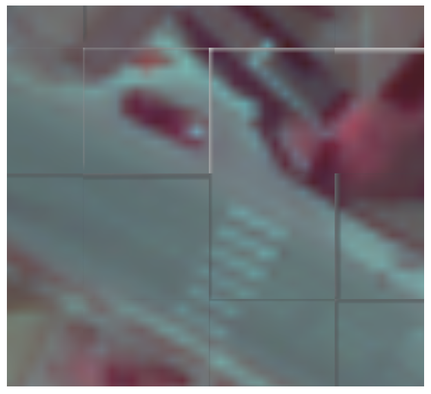

**Coopération pour l'Information Géographique en Alsace**

# Recherche d’optimisation pour la publication web de données raster sur Geoserver via GDAL dans un contexte geOrchestra

<!-- TOC depthFrom:2 depthTo:3 withLinks:1 updateOnSave:0 orderedList:0 -->

- [Avant-Propos](#avant-propos-)
- [Compression Raster](#compression-raster-)
- [Confrontation](#confrontation-)
- [Conclusions](#conclusions-)

<!-- /TOC -->

## Avant-Propos <a id="avant-propos-"></a>

La préparation de données Raster est fonction de compromis entre espace disque disponible, des outils à disposition et des attentes du public ciblé (performance et qualité de rendu).

Une donnée livrée est rarement directement prête pour être servie de manière optimisée en flux pour trois raisons :

-	Les volumétries des données brutes peuvent se révélées très importantes et les espaces disques serveurs onéreux
-	Les zones de bordure peuvent nécessiter une préparation particulière pour un affichage propre (canal alpha de transparence, footprint, nodata ou sld)
-	Modifier des paramètres avancés tels que le tuilage interne (inner tiling), les aperçus (overview) ou la taille des dalles (merge) influence les temps de réponse.

Avec Geoserver l’administrateur de donnée dispose de toute une gamme de formats en entrée.

Ce guide a pour vocation de capitaliser les éléments justifiant les choix en matière de préparation de Raster sur la géoplateforme CIGAL.


## Compression raster <a id="compression-raster-"></a>

Performances et volumétrie fluctuent de manière importante selon le mode de compression retenu.

| Compression | Commentaire |
|----------|--------------|
|ecw|Avec ou sans perte. Format propriétaire qui nécessite une licence pour la publication web. Il ne sera pas traité dans la suite du document.|
|Jp2000|Avec ou sans perte. Mal supporté par Geoserver 2.8 il ne sera pas traité dans la suite du document. L'alternative j2k n'a pas été étudiée.|
|tif LZW|Sans perte|
|tif deflate|Sans perte|
|tif jpeg|Avec perte|

Cf littérature web pour de plus amples information sur les algorithmes utilisés

A titre d’exemple ci-dessous les variations en volumétrie d’une ortho RVB à 20cm de résolution :

| Format                        | Taille proportion | Volume sur 1 département |
|-------------------------------|-------------------|--------------------------|
| tif (livraison brute)           | 100%              | 412Go                    |
| tif tiling overview             | 142%              | 585Go                    |
| tif lzw tiling overview          | 137%              | 565Go                    |
| tif deflate tiling overview      | 110%              | 453Go                    |
| tif deflate alpha tiling overview | 119%              | 490Go                    |
| tif jpeg tiling overview         | 27%               | 111Go                    |
| tif jpeg alpha tiling overview    | 40%               | 165Go                    |

(Ces résultats ont été obtenus dans les taux de compression par défaut et en rajoutant les inner tiling et overview pour préparer à la publication)

```
gdal_translate -a_srs EPSG:3948 -co COMPRESS=DEFLATE -co TILED=YES -co BLOCKXSIZE=512 -co BLOCKYSIZE=512 input.tif output.tif
gdaladdo --config COMPRESS_OVERVIEW DEFLATE --config GDAL_TIFF_OVR_BLOCKSIZE 512 output.tif 2 4 8 16 32 64 128

```

Si l’on souhaite rajouter la bande alpha au fichier il faut prévoir environ 10% de place de stockage en plus

A noter que nous ne considérons pas ici les possibilités de varier l’option PREDICTOR en horizontal ou floating qui donne de meilleurs résultats mais qui semble mal gérée par Geoserver 2.8 (edit d'après la liste Geoserver : predictor=3 n'est pas supporté du tout et type=2 ne supporte pas les 32 bit data).

De la même manière nous avons constaté dans nos tests que les overview externes ne seraient pas supportées par Geoserver 2.8

Pour les scripts batch de préparation se référer à
https://github.com/cigalsace/processes/tree/master/gdal

### Confrontation <a id="confrontation-"></a>

D’après

http://geoserver.geo-solutions.it/edu/en/enterprise/index.html

https://wiki.osgeo.org/wiki/Banc_d'essai_comparatif

http://www.digital-geography.com/geotiff-compression-comparison/#.V616dTUl8cN

Ainsi ques des tests basiques jmeter
https://github.com/cigalsace/processes/tree/master/jmeter

Dans l'ordre des cartouches:

| Data | Size Go | prepa |
|----------|------------|-----------|
|ecw |0.621 |none 3948|
|tifa deflate|8.4 |mosa overview inner tiling 3948|
|tifa lzw|11|mosa overview inner tiling 3948|
|tif deflate|7.7|mosa overview inner tiling 3948|
|tifa jpeg|2.8|mosa overview inner tiling 3948|
|tifa deflate|7.5|pyramid inner tiling 3948|

https://www.cigalsace.org/geoserver/test_public/ows?SERVICE=WMS&VERSION=1.3.0&FORMAT=image/jpeg&REQUEST=GetMap&SRS=EPSG:3948


https://www.cigalsace.org/geoserver/test_public/ows?SERVICE=WMS&VERSION=1.3.0&FORMAT=image/png&REQUEST=GetMap&SRS=EPSG:3948


https://www.cigalsace.org/geoserver/test_public/ows?SERVICE=WMS&VERSION=1.3.0&FORMAT=image/jpeg&REQUEST=GetMap&SRS=EPSG:3857


https://www.cigalsace.org/geoserver/test_public/ows?SERVICE=WMS&VERSION=1.3.0&FORMAT=image/png&REQUEST=GetMap&SRS=EPSG:3948


Geoserver 2.8 supporte mal le format ecw

On voit que le tif deflate donne de bons résultats pour un compromis entre volumétrie et performance.

Ci-dessous, les BigTiff répondent vraiment bien (ici avec granule d'environ 10 Giga + overview externe) car moins de fichiers à ouvrir.


Les entrepots de type image mosaique réagissent mieux. De plus, ils proposent maintenant une fonctionalité footprints qui permettrait de faire l'économie de la bande alpha. Par contre nous identifions un problème répertorié ici
https://osgeo-org.atlassian.net/browse/GEOS-6760?attachmentViewMode=list
Dans le cas d'overview interne il n'est pas possible pour le moment d'appliquer un footprints couvrant des dalles non pleines. Fonctionnalité décrite ici
http://docs.geoserver.org/2.8.x/en/user/tutorials/imagemosaic_footprint/imagemosaic_footprint.html#footprint-configured-with-footprints-shp
Un contournement serait de passer par input transparent color (000000) avec NoData Value=0

Il faut savoir également que l'on ne peut pas supprimer proprement les overviews ce qui rendrait problématique les récupérations WCS dans d'autres projections.

Enfin, appeler un WMS dans une projection différente de celle native de publication ne semble pas trop impactante par rapport aux temps de retour.


Par contre sous Geoserver la qualité du rendu est dégradée par rapport à image pyramide car Geoserver récupère l'overview la plus proche pour reprojeter ce qui n'est pas idéal.

Par exemple si dans un projet qgis en 3857 au 1/25000 je charge /mnt/geoserver_geodata/data/CIGAL/CIGAL_ORTHORVB_2015_ALSACE_TIF_L93/1025-6850_O.tif


Puis le WMS (cigal:CIGAL_ORTHORVB_2015_ALSACE_TIF_L93)


De plus les appels à petite échelle sur une ortho départementale en image mosa sont vraiment peu performants malgré les overviews.

En ce qui concerne les contours, la bande alpha prend de la place mais les contours sont mieux dessinés.
On a constaté qu'en compression JPEG les contours avec la méthode input transparent donnaient des bordures de mauvaise qualité.



De manière anecdotique, le format image pyramide apporte des défaut à très très grand échelle sur le sviewer (pas constaté sur mapfishapp)



## Conclusions <a id="conclusions"></a>

Le tif non compressé est le format qui apporte les meilleures performances. Cependant, une ortho 20cm en tif deflate sur 10 départements pèserait 4.5 To. Un équilibre est donc à trouver.

Dans le cas de la géoplateforme CIGAL nous retenons pour le moment les pistes suivantes:

- Privilégier deflate à lzw
- Image mosaique ou image pyramide selon les cas avec input transparent pour les zones de bordure
Voir https://github.com/cigalsace/documentation/tree/master/tuto_prepa_publication_raster
- En général nous réservons la qualité optimale (sans perte) à la dernière ortho (par exemple la 2015) et les milésimes plus anciens, les produits dérivés (infrarouge…) sont compressées en JPEG
- L'axe par téléchargement FTP des dalles type Open Data serait privélégié au détriment du WCS consommateur pour les servers.
- Le l93 serait prioritaire comme format de publication.

Resterait également:

- à jouer sur les pararamètres Geoserver
http://fr.slideshare.net/geosolutions/geoserver-on-steroids-foss4g-2015
(slide 11)
- à exploiter Geowebcache WMTS dans les gridset les plus couramment utilisés
- à encourager pour les viewers les appels image/jpeg sur de petites tuiles
- à tester dans Geoserver paramètre en-tête de chache de réponse (configuration HTTP). (après un premier affichage, tous les objets seront en mémoire dans le navigateur et seront affichés plus rapidement. Dans l'édition de la couche > publication, cochez En-tête de cache de réponse et indiquez un temps de mis en cache par exemple 3600 s.)
https://agile-online.org/conference_paper/cds/agile_2012/proceedings/papers/paper_loechel_caching_techniques_for_high-performance_web_map_services_2012.pdf
