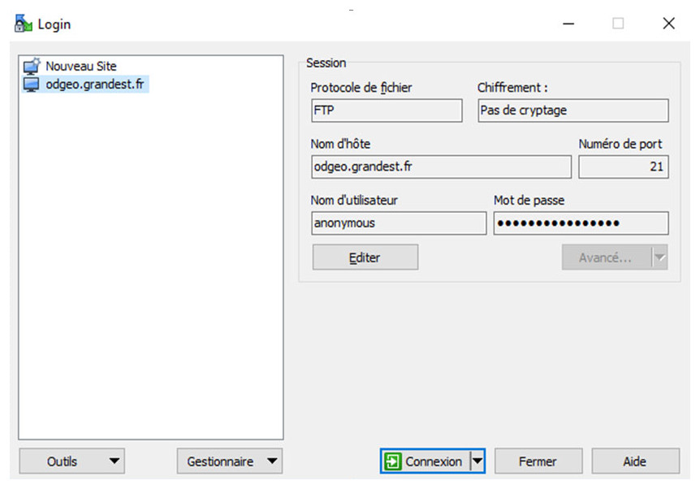

**Coopération pour l'Information Géographique en Alsace**

# Comment télécharger des données images sur la plateforme Open Data information géographique Grand Est ?

<!-- TOC depthFrom:2 depthTo:3 withLinks:1 updateOnSave:0 orderedList:0 -->

- [Contexte](#contexte-)

- [Procédure](#procédure-)
	- [Eléments pour la connexion](#elements_pour_la_connexion-)
	- [Exemple avec WinSCP](#exemple_winscp-)
	- [Exemple avec FileZila](#exemple_filezila-)
	- [Organisation des fichiers](#orga_fichiers-)

<!-- /TOC -->


## Contexte <a id="contexte-"></a>

Un certain nombre de données images (orthophotographies, modèles numériques d'élévation) ont été acquis en licence ouverte EtatLab.
Les orthophotographies peuvent être utilisées via les flux WMS de la géoplateforme CIGAL <https://www.cigalsace.org/portail/fr/page/723/flux-donnees>.

Pour certain besoin, il peut être nécessaire de télécharger les images. Voici comment procéder !


## Procédure <a id="procédure-"></a>

### Eléments pour la connexion  <a id="elements_pour_la_connexion-"></a>

Pour vous connecter au serveur Open Data information géographique, vous devez utiliser l'adresse odgeo.grandest.fr avec le protocole FTP et la connexion anonyme.


### Exemple avec WinSCP  <a id="exemple_winscp-"></a>




### Exemple avec FileZila  <a id="exemple_filezila-"></a>


### Organisation des fichiers  <a id="orga_fichiers-"></a>

Organisation des fichiers par département en se rapprochant des règles de nommage IGN

```{PROD}_{OPTION}_{RES}_{FORMAT}_{RIG}_{INFO}```

Par exemple :

* open_data
 * OHR_RVB_0M20_JP2-E100_LAMB93_D67-2015
   * data
   * metadata
   * catalog
 * OHR_RVB_0M20_JP2-E100_LAMB93_D57-2015
   * data
   * metadata
   * catalog
 * OHR_IRC_0M20_JP2-E100_LAMB93_D68-2015
   * data
   * metadata
   * catalog
 * OHR_MNS_0M20_TIF_LAMB93_D57-2015 
   * data
   * metadata
   * catalog
 * BDOHISTO_NB_67_0M50_1950_LACC48
   * data
   * metadata
   * catalog

Les images RVB et IRC sont compressées en JPEG2000 e100 version "standard" (compression sans perte) avec un dallage de 1 x 1 km.
Le MNS est proposé en format tif avec fichiers TFW, HDR et grf associés regroupés dans des paquets ZIP.


