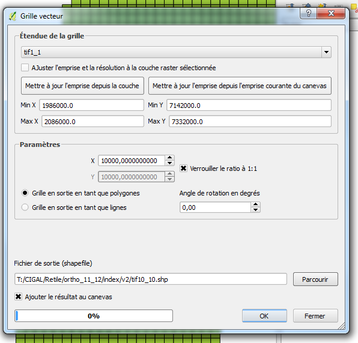
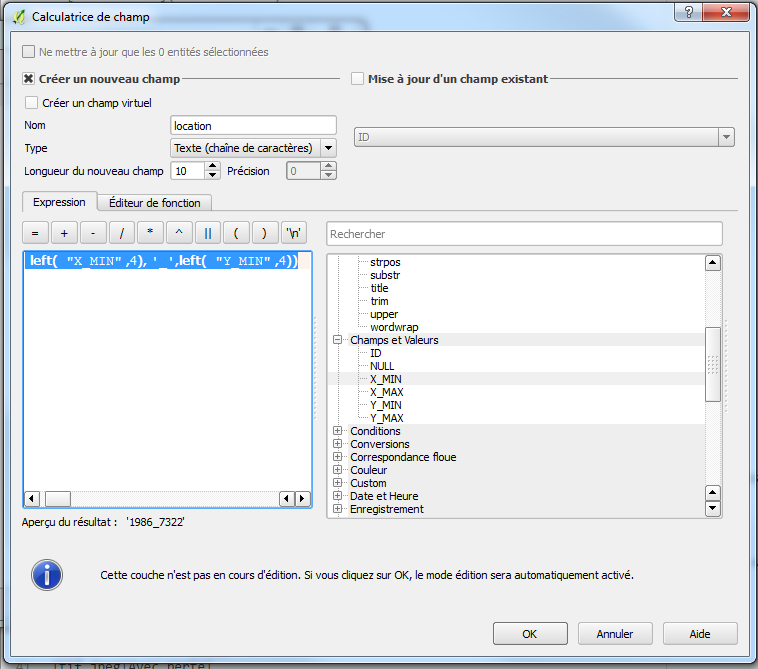
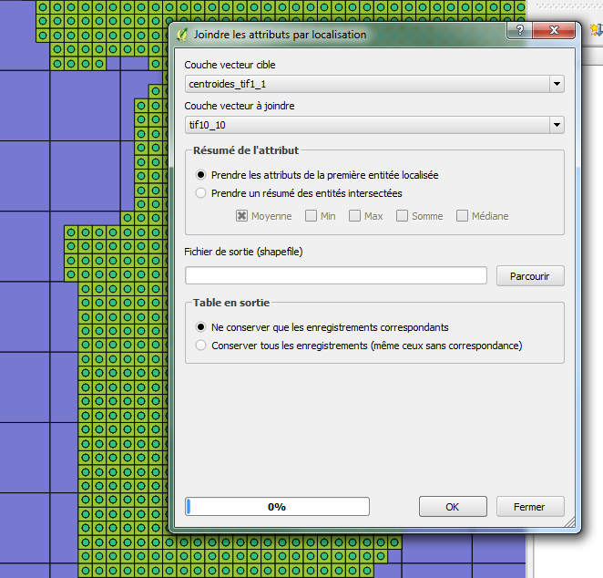

**Coopération pour l'Information Géographique en Alsace**

# Tutoriel pour la publication web de données Raster sur Geoserver via GDAL dans un contexte geOrchestra

<!-- TOC depthFrom:2 depthTo:3 withLinks:1 updateOnSave:0 orderedList:0 -->

- [Etape 1: Index et nouvelle maille](#etape1-)
- [Etape 2: Merge raster](#etape2-)
- [Etape 3: Préparation gdal](#etape3)

<!-- /TOC -->

Justification des choix dans https://github.com/cigalsace/documentation/tree/master/guide_prepa_publication_raster

## Etape 1: Index et nouvelle maille <a id="etape1-"></a>

Tout d'abord, reconstituons l'index des dalles livrées

```gdaltindex 1_1.shp data\*.tif```

L'objectif est ici de redéfinir de nouvelles dalles entre 1 et 10Go en tif non compressé, par exemple ici en 10/10km

Pour cela nous utilisons

*vecteur/outils de recherche/grille vecteur*

Attention à ce que le projet soit bien dans la même projection que le carroyage



Les identifiants des nouvelles dalles sont crées à l'aide de la calculatrice de champs QGIS

```concat(  left(  "X_MIN" ,4), '_',left(  "Y_MIN" ,4))```



## Etape 2: Merge raster <a id="etape2-"></a>

L'étape suivante consiste à calculer les centroides de la maille d'origine 1_1.shp

*vecteur/outils de géométrie/centroïdes de polygones*

Puis de récupérer pour chaque point les identifiants des dalles 10/10

*vecteur/outils de gestion de données/joindre les attributs par localisation*



Copier coller la nouvelle table d'attribut dans un tableur afin de ne garder que la correspondance

|      10_10         |      1_1     |
|----------|--------------|
|1986_7302|\\path\1988_7308_C48.tif|
|1986_7302|\\path\1988_7308_C48.tif|
|...|...|

La macro excel transpo.xls https://github.com/cigalsace/documentation/blob/master/tuto_prepa_publication_raster/transpo.xls nous permet de regrouper les dalles par paquet

On retravaille le résultat par concaténation de manière à obtenir pour chaque dalle

```call gdal_merge -init 255 -o output.tif input1_1.tif input1_2.tif... ```

## Etape 3: Préparation gdal<a id="etape3-"></a>

Nous utilisons la compression deflate en jouant également sur le inner tiling

```gdal_translate -a_srs EPSG:3948 -co COMPRESS=DEFLATE -co BIGTIFF=YES -co "TILED=YES" -co "BLOCKXSIZE=512" -co "BLOCKYSIZE=512" input.tif output.tif```

Avant de finir en calculant les overview

```gdaladdo -ro -r average --config COMPRESS_OVERVIEW DEFLATE --config GDAL_TIFF_OVR_BLOCKSIZE 512 E:\raster\ortho11_12\%%~nG_O.tif 2 4 8 16 32 64 128```

Voir https://github.com/cigalsace/processes/blob/master/gdal/RVB_mosa_BIGTIF.bat pour la procédure batchée
